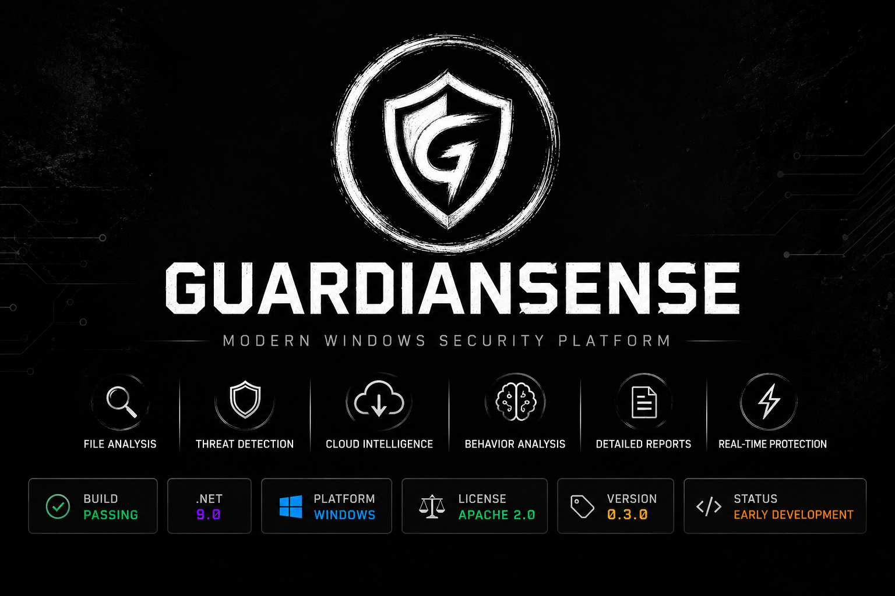

<p align="center">
  
</p>

<h1 align="center">GuardianSense</h1>

<p align="center">
Modern Windows Security Platform
</p>

<p align="center">


## Features

### Current

* Provider-based analysis pipeline
* SHA-256 file hashing
* Magic byte file type detection
* Local risk assessment
* Download folder monitoring
* Structured analysis reports
* Modular architecture with dependency injection
* Detailed logging

### Planned

* Authenticode verification
* VirusTotal integration
* MalwareBazaar integration
* ClamAV support
* YARA rule scanning
* Quarantine management
* Behavioral analysis
* Sandbox execution
* Machine learning-based detection
* Plugin system
* Modern desktop interface

---

## Project Structure

```text
GuardianSense
│
├── Guardian.Analysis     # File analysis engine
├── Guardian.Service      # Background Windows service
├── Guardian.Shared       # Shared models and contracts
└── Guardian.Tray         # System tray application
```

---

## Architecture

```text
DownloadWatcher
        │
        ▼
AnalysisPipeline
        │
        ▼
Providers
 ├── HashProvider
 ├── MagicByteProvider
 ├── RiskProvider
 └── (Upcoming Providers)
        │
        ▼
Analysis Report
```

GuardianSense uses a provider-based architecture, allowing new analysis modules to be added without modifying the core pipeline.

---

## Roadmap

### Phase 1 – Foundation ✅

* Download monitoring
* Provider architecture
* SHA-256 hashing
* Magic byte detection
* Risk assessment
* Logging

### Phase 2 – Trust Verification 🚧

* Authenticode
* Certificate validation
* Publisher detection

### Future

* Cloud reputation services
* Local malware engines
* Sandboxing
* Machine learning
* Plugin ecosystem

---

## Building

Requirements:

* .NET 9 SDK
* Windows 10 or Windows 11
* Visual Studio 2022 (or newer)

Clone the repository:

```bash
git clone https://github.com/<your-username>/GuardianSense.git
```

Build the solution:

```bash
dotnet build
```

Run the service:

```bash
dotnet run --project Guardian.Service
```

---

## Contributing

Contributions, feature requests, and bug reports are welcome.

If you would like to contribute:

1. Fork the repository
2. Create a feature branch
3. Commit your changes
4. Open a Pull Request

---

## License

This project is licensed under the MIT License.

See the `LICENSE` file for details.
